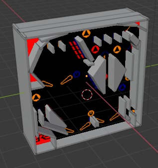

# HelloPinball JME3

__macadam.blend__

Je superpose des formes rectangulaire sur l'image de fond de Macadam Bumper CPC. J'utilise parfois la forme convex.

__HelloPinball.java__

Touche : SHIFT gauche, SHIFT droite, ESPACE relancer la balle.

La balle est lancée automatiquement.

__ressources__

jmonkeyengine-master : API RigidBody avec exemples

Roller Ball (1984) 3D [MSX pinball game remake] (Java pinball from scratch) testé OK
* https://www.youtube.com/watch?v=LpHc9VU2VJU
* https://jvm-gaming.org/t/roller-ball-1984-3d-msx-pinball-game-remake/59673
* src https://github.com/leonardo-ono/JavaRollerBall3D